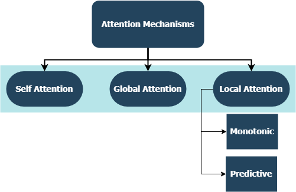
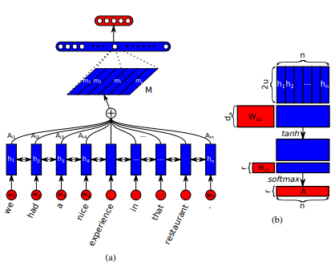
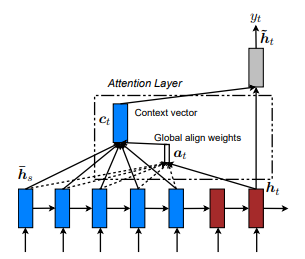
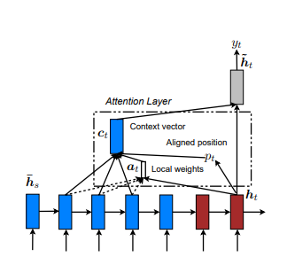
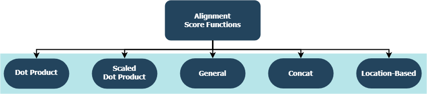

# Attention Mechanisms

## Table of Contents  
1. [Introduction](#introduction)
2. [Attention Types](#attention-types)
   * [Self Attention](#self-attention)
   * [Global Attention](#global-attention)
   * [Local Attention](#local-attention)
3. [Alignment Functions](#alignment-functions)
4. [Implementation Details](#implementation-details)
5. [Examples](#examples)
   * [Sentiment Classification](#sentiment-classification)
   * [Text Generation](#text-generation)
   * [Machine Translation](#machine-translation)
6. [Contributing](#contributing)
7. [Resources](#resources)

## Introduction
This repository includes custom layer implementations for a whole family of attention mechanisms, compatible with TensorFlow and Keras integration. Attention mechanisms have transformed the landscape of machine translation, and their utilization in other domains of natural language processing & understanding are increasing day by day. In a broader sense, they aim to eliminate the disadvantageous compression and loss of information in RNNs. These originate due to the fixed-length encoding of hidden states derived from input sequences by recurrent layers in sequence-to-sequence models. The layers in this repository can be used for both **many-to-many** and **many-to-one** sequence tasks. Applications include *sentiment classification*, *text generation*, *machine translation*, and *question answering*. It is also worthwhile to mention that this project will soon be **deployed** as a Python package. Check *Contributing* subsection on how to contribute to this project.

## Attention Types
<p align="center">

</p>

### Self Attention
First introduced in *Long Short-Term Memory-Networks for Machine Reading* by Jianpeng Cheng et al. The idea is to relate different positions of the same hidden state space derived from the input sequence, based on the argument that multiple components together form the overall semantics of a sequence. This approach brings together these differently positioned information through **multiple hops** attention. This particular implementation follows *A Structured Self-Attentive Sentence Embedding* by Zhouhan Lin et al. where authors propose an additional loss metric for regularization to prevent the redundancy problems of the embedding matrix if the attention mechanism always provides similar annotation weights.

<p align="center">

</p>

### Global (Soft) Attention
First introduced in *Neural Machine Translation by Jointly Learning to Align and Translate* by Dzmitry Bahdanau et al. The idea is to derive a context vector based on **all** hidden states of the encoder RNN. Hence, it is said that this type of attention **attends** to the entire input state space.

<p align="center">

</p>

### Local (Hard) Attention
First introduced in *Show, Attend and Tell: Neural Image Caption Generation with Visual Attention* by Kelvin Xu et al. and adapted to NLP in *Effective Approaches to Attention-based Neural Machine Translation* by Minh-Thang Luong et al. The idea is to  eliminate the attentive cost of global attention by instead focusing on a small subset of tokens in hidden states set derived from the input sequence. This window is proposed as ```[p_t-D, p_t+D]``` where ```D=width```, and we disregard positions that cross sequence boundaries. The aligned position, ```p_t```, is decided either through **a) monotonic alignment:** set ```p_t=t```, or **b) predictive alignment**: set ```p_t = S*sigmoid(FC1(tanh(FC2(h_t)))``` where fully-connected layers are trainable weight matrices. Since yielding an integer index value is undifferentiable due to ```tf.cast()``` and similar methods, this implementation instead derives a aligned position float value and uses Gaussian distribution to adjust the attention weights of all source hidden states instead of slicing the actual window. We also propose an experimental alignment type, **c) completely predictive alignment:** set ```p_t``` as in ii), but apply it to all source hidden states (```h_s```) instead of the target hidden state (```h_t```). Then, choose top ```@window_width``` positions to build the context vector and zero out the rest. Currently, this option is only avaiable for many-to-one scenarios.

<p align="center">

</p>

### Hierarchical Attention
First introduced in *Hierarchical Attention Networks for Document Classification* by Zichao Yang et al.  The idea is to reflect the hierarchical structure that exists within documents. The original paper proposes a **bottom-up** approach by applying attention mechanisms sequentially at word- and sentence-levels, but a **top-down** approach (ex. word- and character-levels) is also applicable. Hence, this type of mechanisms is said to attend differentially to more and less important content when constructing the document representation.

## Alignment Functions
<p align="center">

</p>

Each function is trying to compute an alignment score given a target hidden state (```h_t```) and source hidden states (```h_s```).

| Name | Formula for  | Defined by |
| ------- | --- | --- |
| Dot Product |  | Luong et al. (2015) |
| Scaled Dot Product |  | Vaswani et al. (2017) |
| General |  | Luong et al. (2015) |
| Concat |  | Bahdanau et al. (2015) |
| Location |  | Luong et al. (2015) |

where ```H``` is the number of hidden states given by the encoder RNN, and where ```W_a``` and ```v_a``` are trainable weight matrices.

## Implementation Details
* As of now, all attention mechanisms in this repository are successfully tested with applications in both many-to-one and many-to-many sequence tasks. Check the *Examples* subsection for example applications.
* It should be noted that there is no claim that the attention mechanisms represented in this repository (and their accompanying hyperparameters represented in *Examples* subsection) is optimized in anyway; there is still a lot of room for improvement from both a software development and research perspective.
* Every layer is a subclass of ```tf.keras.layers.Layer()```.
* The ```__init__()``` method of each custom class calls the the initialization method of its parent and defines additional attributes specific to each layer.
* The ```get_config()``` method calls the configuration method of its parent and defines custom attributes introduced with the layer.
* If a custom layer includes method ```build()```, then it contains trainable parameters. Take the ```Attention()``` layer for example, the backpropagation of the loss signals which inputs to give more care to and hence indicates a change in weights of the layer.
* The ```call()``` method is the actual operation that is performed on the input tensors.
* ```compute_output_shape()``` methods are avoided for spacing.

## Examples
These layers can be plugged-in to your projects (whether language models or other types of RNNs) within seconds, just like any other TensorFlow layer with Keras integration. See the below general-purpose example for instance:
```
from tensorflow.keras.layers import Input, Embedding, LSTM, Dense
from layers import Attention

X = Input(shape=(sequence_length,), batch_size=batch_size) # define input layer for summary
## Token Embedding (Pretrained or Not) ##
embedding = Embedding(input_dim=vocabulary_size, output_dim=embedded_dimensions)(X)
## Encoding Recurrent Layers ##
encoder = LSTM(units=recurrent_units, return_sequences=True)(embedding) # keep timesteps
## Decoding with Attention ##
decoder, attention_weights = Attention(context='many-to-one', alignment_type=attention_type, model_api='functional')(encoder)
## Prediction Layer ##
Y = Dense(units=vocabulary_size, activation='softmax')(decoder)
```
where ```alignment_type``` is one of ```'global'```, ```'local-m'```, ```'local-p'```, and ```'local-p*'```. For self attention, call the ```SelfAttention(size=attention_size)``` layer instead. 

Check below subtopics for more examples, analyses, and comparisons. For fair comparison, all compared models utilize similar parameters. For example, a batch size of *100* and a number of epochs of *20* were preferred on some examples.

### Sentiment Classification
You can find a sentiment classification (many-to-one, binary) example on [IMBD Reviews Dataset](https://www.tensorflow.org/api_docs/python/tf/keras/datasets/imdb) inside ```examples/sentiment_classification.py```. This example compares three distinct ```tf.keras.Model()```(*Functional API*) models (all word-level) and aims to measure the effectiveness of the implemented self-attention layer over the conventional MLP (Multi Layer Perceptron) model. Refer to the below table for metrics:

| Model ID | Maximum Validation Binary Accuracy |
| -------- | ---------------------------------- |
| Simple Multi-Layer Perceptron Model | 0.8730 |
| Simple Multi-Layer Perceptron Model w/ Self-Attention (Non-Penalized) | **0.8907** |
| Simple Multi-Layer Perceptron Model w/ Self-Attention (Penalized) | 0.8870 |

### Text Generation
You can find a text generation (many-to-one) example on [Shakespeare Dataset](https://www.tensorflow.org/beta/tutorials/text/text_generation) inside ```examples/text_generation.py```. This example compares three distinct ```tf.keras.Model()```(*Functional API*) models (all character-level) and aims to measure the effectiveness of the implemented attention and self-attention layers over the conventional LSTM (Long Short Term Memory) models. Refer to the below table for metrics:

| Model ID | Maximum Validation Categorical Accuracy |
| -------- | --------------------------------------- |
| LSTM Model | 0.5953 | 
| LSTM Model w/ Self-Attention (Non-Penalized) | 0.6049 |
| LSTM Model w/ Local-p* Attention | **0.6234** |

### Document Classification
You can find a document (news) classification (many-to-one, multi-class) example on [Reuters Dataset](https://www.tensorflow.org/api_docs/python/tf/keras/datasets/reuters) inside ```examples/document_classification.py```. This example compares four distinct ```tf.keras.Model()```(*Functional API*) models (all word-level) and aims to measure the effectiveness of the implemented attention and self-attention layers over the conventional LSTM (Long Short Term Memory) models. Refer to the below table for metrics:

| Model ID | Maximum Validation Categorical Accuracy |
| -------- | --------------------------------------- |
| LSTM Model | 0.7210 | 
| LSTM Model w/ Self-Attention (Non-Penalized) | **0.7790** |
| LSTM Model w/ Global Attention | 0.7496 |
| LSTM Model w/ Local-p* Attention | 0.7446 |

### Machine Translation
You can find a machine translation (many-to-many) example on [English-to-Spanish Dataset](http://www.manythings.org/anki/) inside ```examples/machine_translation.py```. This example pretty much follows [TensorFlow's Machine Translation Example](https://www.tensorflow.org/beta/tutorials/text/nmt_with_attention) with some adaptions. It compares four distinct ```tf.keras.Model()```(*Functional API*) models (all word-level) and aims to measure the effectiveness of the implemented attention layer. Refer to the below table for metrics:

| Model ID | Maximum Validation Categorical Accuracy |
| -------- | --------------------------------------- |
| Encoder-Decoder Model | 0.8848 | 
| Encoder-Decoder Model w/ Global Attention | 0.8860 | 
| Encoder-Decoder Model w/ Local-m Attention | **0.9524** | 
| Encoder-Decoder Model w/ Local-p Attention | 0.8873 | 

## Contributing
Whether it is bugs you have encountered, performance concerns, or any kind of input you have in mind, this is the perfect time to share them! Check ```CONTRIBUTING.md``` for more information and guidelines on this topic.

## Resources
* All papers mentioned above.
* [Lilian Weng's Beautiful Blog Post](https://lilianweng.github.io/lil-log/2018/06/24/attention-attention.html)
* [Philippe Remy's Attention Implementations & Corresponding Issues](https://github.com/philipperemy/keras-attention-mechanism/issues/14)
* [TensorFlow's Text Generation Example](https://www.tensorflow.org/beta/tutorials/text/text_generation)
* [TensorFlow's Machine Translation Example](https://www.tensorflow.org/beta/tutorials/text/nmt_with_attention)
* [Jason Brownlee's Amazing Blog Post](https://machinelearningmastery.com/predict-sentiment-movie-reviews-using-deep-learning/)
